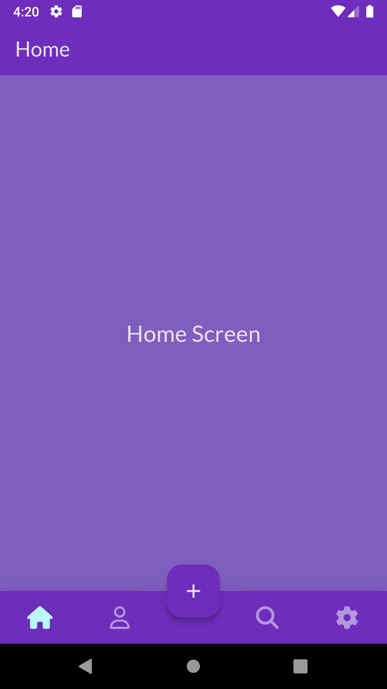

# Custom Bottom Bar App
A Flutter application featuring a custom animated bottom navigation bar with unique design and animations. The app supports a dark theme with a unique purple accent.

## 🌟 Features
- Custom animated bottom navigation bar
- Dark theme with purple accent
- Modern and responsive design

## 📸 Screenshots

## 🛠️ Technologies Used
- **Frontend**: Flutter, Dart
- **Plugins**: font_awesome_flutter, google_fonts, animated_bottom_navigation_bar

## 📝 Setup Instructions
Follow these steps to set up the project locally:

### 1. Clone the Repository
\`\`\`bash
git clone https://github.com/obadaKraishan/custom_bottom_bar.git
cd custom_bottom_bar_app
\`\`\`

### 2. Install Dependencies
\`\`\`bash
flutter pub get
\`\`\`

### 3. Run the Application
\`\`\`bash
flutter run
\`\`\`

## 📄 Project Structure
\`\`\`plaintext
lib/
├── models/
│   └── bottom_nav_item.dart
├── screens/
│   ├── home_screen.dart
│   ├── profile_screen.dart
│   ├── search_screen.dart
│   └── settings_screen.dart
├── widgets/
│   └── custom_bottom_bar.dart
├── main.dart
\`\`\`

## 🎨 Customization
### 1. Update Theme
Modify the theme settings in \`main.dart\` to customize the app's look and feel.

### 2. Update Bottom Navigation Items
Adjust the navigation items in \`widgets/custom_bottom_bar.dart\` to add or remove items as needed.

### 3. Add New Screens
Create new screens in the \`screens/\` directory and update \`widgets/custom_bottom_bar.dart\` to include them in the app's navigation.

## 📄 License
This project is licensed under the MIT License - see the [LICENSE](LICENSE) file for details.

## 👥 Contributors
- [Obada Kraishan](https://github.com/obadaKraishan)
